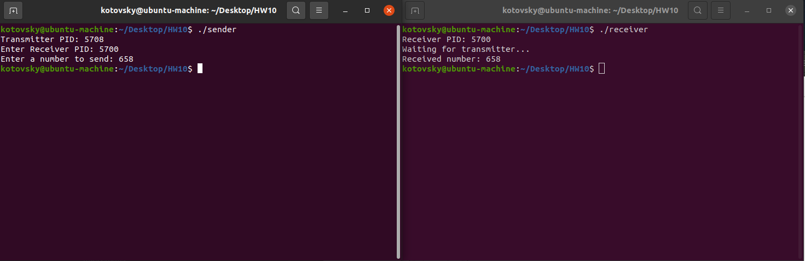

# Домашнее задание №10. Операционные системы
### Выполнил Котовский Семён Олегович, БПИ-219.
### Отчет о работе программы
### Задача

Побитовая передача целого числа от одного процесса другому с помощью сигналов SIGUSR1, SIGUSR2. Необходимо написать две программы — передатчик и приемник, которые будут запускаться с разных терминалов. Каждая программа вначале печатает свой PID и запрашивает ввод с клавиатуры PID программы–собеседника (вводится пользователем). Порядок ввода PID не имеет значения. Программа—передатчик запрашивает с клавиатуры ввод целого десятичного числа (число может быть и отрицательным!). Введенное число побитово передается программе-приемнику с использованием пользовательских сигналов SIGUSR1 и SIGUSR2. Программа–приемник после завершения приема печатает принятое число в десятичной системе счисления.
### Описание программы:

Программа состоит из двух частей: программы-отправителя и программы-получателя. Программа-отправитель передает число в двоичном виде с помощью сигналов SIGUSR1 и SIGUSR2, а программа-получатель обрабатывает эти сигналы и выводит полученное число на экран.
#### Получатель (receiver.c)

Программа-получатель объявляет две глобальные переменные bit_count и received_num, которые будут использоваться для хранения количества полученных битов и самого полученного числа.
Определяются обработчики сигналов sigusr1_handler и sigusr2_handler для сигналов SIGUSR1 и SIGUSR2 соответственно. Обработчик sigusr1_handler увеличивает счетчик битов, а обработчик sigusr2_handler устанавливает соответствующий бит числа и увеличивает счетчик битов.
В функции main задаются обработчики сигналов с помощью вызовов sigaction и выводится идентификатор процесса (PID) для информации.
Программа-получатель ожидает получения 32 битов, после чего выводит полученное число и завершает работу.

#### Отправитель (sender.c)

В функции main программа-отправитель запрашивает PID получателя и число, которое необходимо передать.
Программа-отправитель передает каждый бит числа, вызывая функцию transmit_bit. В этой функции происходит отправка сигнала SIGUSR1 или SIGUSR2 в зависимости от значения бита. После отправки сигнала вызывается функция usleep для задержки передачи следующего бита.

#### Запуск программы

#### Компиляция программы:
```
gcc -o receiver receiver.c
gcc -o sender sender.c
```

#### Запуск программы:

Запустите программу-получатель:

```
./receiver
```

Запишите PID, который выведет программа-получатель.
Запустите программу-отправитель, указав PID получателя и число для передачи:

```
./sender
```

Пример работы программы:

Запустите программу-получатель в одном терминале:

```
$ ./receiver
Receiver PID: 12345
Waiting for transmitter...
```

Запустите программу-отправитель в другом терминале, указав PID получателя (в данном случае 12345) и число для передачи (например, 42):

```
$ ./sender
Transmitter PID: 54321
Enter Receiver PID: 12345
Enter a number to send: 42
```

Программа-отправитель отправит число 42 в двоичном виде с помощью сигналов SIGUSR1 и SIGUSR2. Программа-получатель обработает эти сигналы и выведет полученное число на экран:

```
Received number: 42
```

Таким образом, программа успешно передает число между двумя процессами с использованием сигналов SIGUSR1 и SIGUSR2.

#### Пример работы программы:
